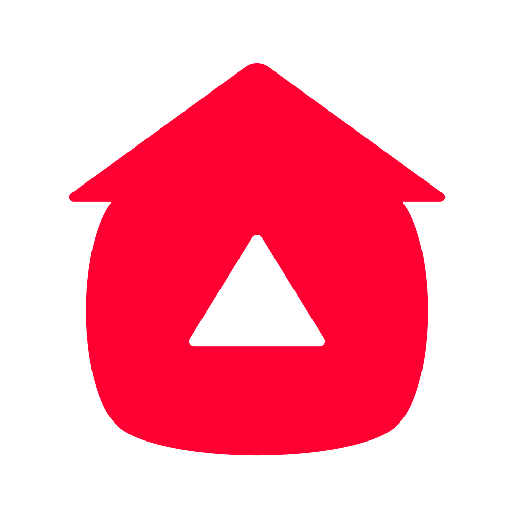

<h1 align="center">☀️ Welcome to My Github ☁️</h1>

<div align="center">
  
</div>

<p align="center">
  
</p>

## 🚀 About Me

> "Creativity doesn't wait for that perfect moment. It fashions its own perfect moments out of ordinary ones." – Bruce Garrabrandt

Passionate developer crafting digital experiences that make a difference. I believe in clean code, continuous learning, and the power of open source.

## 🛠️ Tech Arsenal

```text
🎯 Frontend     ████████████████░░░░░   80%
⚡ Backend      ███████████████████░░   90%
🎨 Design       ██████████░░░░░░░░░░░   50%
☁️ Cloud        ████████████████░░░░░   75%
```

## 🌟 Featured Projects

<table>
  <tr>
    <td width="50%">
      <h3 align="center">OwnTube</h3>
      <p align="center">
        
        <p align="center">
          Open source, self-hosted video platform, alternative to YouTube, realized with Vue.
        </p>
      </p>
    </td>
</table>


## 🌐 Let's Connect

<p align="center">
  <a href="https://linkedin.com/in/jason-beucher/">
    
  </a>
  &nbsp;&nbsp;
  <a href="https://www.codewars.com/users/Spookiss">
    
  </a>
  &nbsp;&nbsp;
  <a href="https://www.codingame.com/profile/46a3b3392f486ab9798fc51b1a903b673412965">
    
  </a>
  &nbsp;&nbsp;
  <a href="https://www.root-me.org/Spookiss">
    
  </a>

</p>

<div align="center">

## 👨🏻‍💻 What i work with
### Programming Languages


### Frameworks and Libraries


### Tools and Databases


</div>

---

<p align="center">
  
</p>

<h4 align="center">
  🌱 Currently learning: <br>
</h4>
